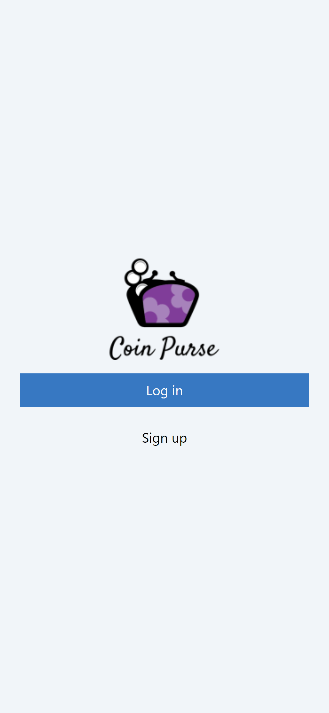
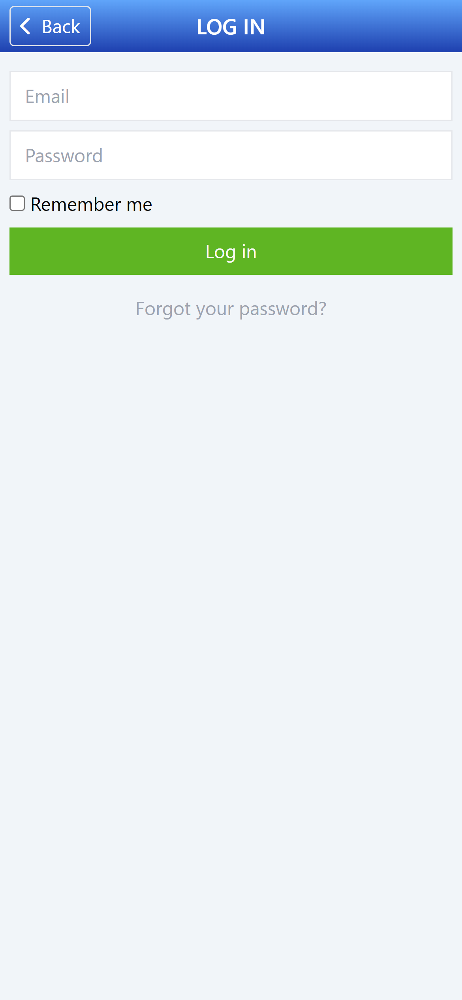
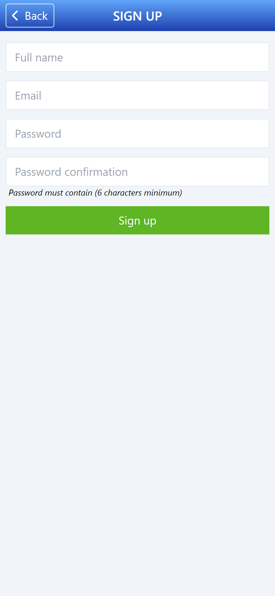
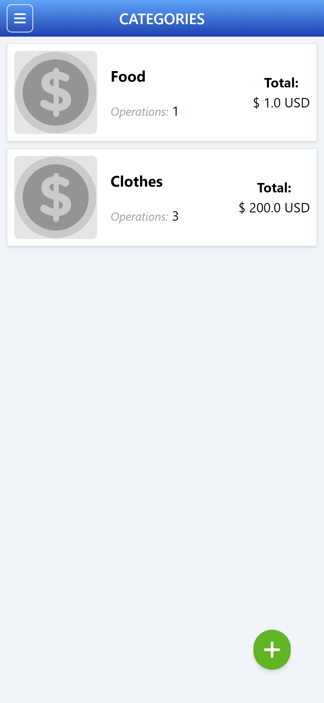
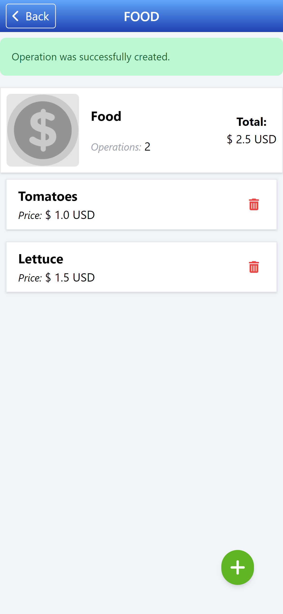
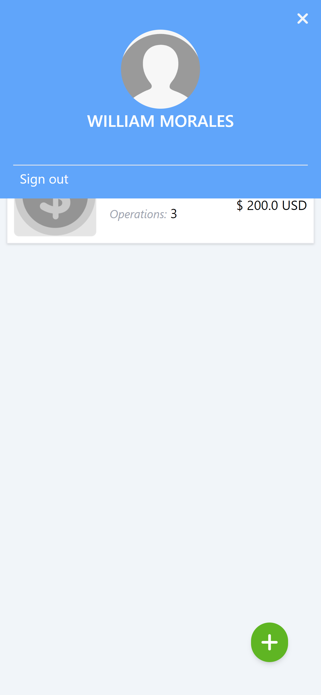

# Recipe App

This app was made to help you track of your expenses, you can store your personal info within your personal account, in this way you can have a secure storage for your information.
### Home page

### Authentication views

The authentication pages help to administer users credentials

### Categories view

The main feature for the app is the ability to manage different categories and track your expenses based on this categories

### Categories view

For each category you can add a new expense and you can always have a good track of your category total

### Menu view

Here you are going to encounter the user info and sign out button

## 🧩 Built With

- Ruby
- Ruby on Rails
- Tailwind CSS
- PostgreSQL
- Linters

## 🖥️ Install

- Install Ruby based on your OS from [HERE](https://www.ruby-lang.org/en/downloads/).

## 📚 Getting Started

1. Clone the project using git-bash or Githup Desktop.
2. Open the project folder with VSCode or any Editor.
3. Open terminal and navigate to the project folder.
4. Set up database for test enviroment with `rails db:migrate RAILS_ENV=test`
5. Run test with `rspec spec`

## 💻📱 Live Preview

<!-- There is no Live Demo available at the moment -->

If you want to see a live demo of this project, [click here](https://wr88-coin-purse.herokuapp.com/home)

## Authors

👤 **William Morales**
- GitHub: [@williamrolando88](https://github.com/williamrolando88)
- Twitter: [@WillyMorales93](https://twitter.com/WillyMorales93)
- LinkedIn: [William Morales](https://www.linkedin.com/in/william-rolando-morales/)

## 🤝 Contributing

Contributions, issues, and feature requests are welcome!

Feel free to check the [issues page](https://github.com/williamrolando88/Recipe-app/issues).

## 👍 Credits -->

GUI & Graphic Design: Gregoire Vella

- Behance: [Gregoire Vella](https://www.behance.net/gregoirevella)

## 👏 Show your support

Give a ⭐️ if you like this project!

## 📝 License

[License: MIT](https://opensource.org/licenses/MIT)

Copyright (c) 2022 William Morales

Permission is hereby granted, free of charge, to any person obtaining a copy of this software and associated documentation files (the "Software"), to deal in the Software without restriction, including without limitation the rights to use, copy, modify, merge, publish, distribute, sublicense, and/or sell copies of the Software, and to permit persons to whom the Software is furnished to do so, subject to the following conditions:

The above copyright notice and this permission notice shall be included in all copies or substantial portions of the Software.

THE SOFTWARE IS PROVIDED "AS IS", WITHOUT WARRANTY OF ANY KIND, EXPRESS OR IMPLIED, INCLUDING BUT NOT LIMITED TO THE WARRANTIES OF MERCHANTABILITY, FITNESS FOR A PARTICULAR PURPOSE AND NONINFRINGEMENT. IN NO EVENT SHALL THE AUTHORS OR COPYRIGHT HOLDERS BE LIABLE FOR ANY CLAIM, DAMAGES OR OTHER LIABILITY, WHETHER IN AN ACTION OF CONTRACT, TORT OR OTHERWISE, ARISING FROM, OUT OF OR IN CONNECTION WITH THE SOFTWARE OR THE USE OR OTHER DEALINGS IN THE SOFTWARE.
